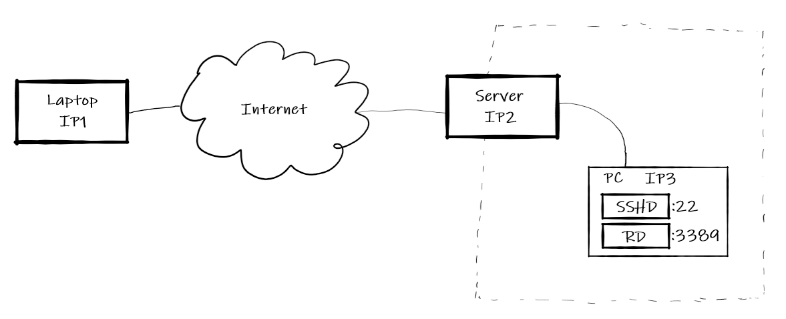
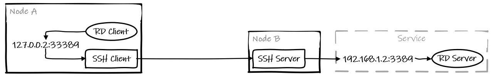

Problem description: I have a PC inside the LAN of my lab, and there is a server in the LAN with a public IP, which I can ssh to. What I'm trying to achieve is to access resources on the PC(files, remote desktop, ssh) through my laptop from anywhere. The idea is to use **ssh tunnel**.

Here is the topology



# Local Port Forward

假设我有一台主机B可以访问位于`192.168.1.2:3389`上的Remote Desktop服务，而主机A无法直接访问。通过在主机B上运行的SSH Server我们可以建立隧道使用本地端口转发来使A访问这一服务：

```bash
ssh -L 127.0.0.2:33389:192.168.1.2:3389 NodeB
```

原理如下：



这条命令将使得A上的SSH Client监听127.0.0.2:33389端口。RD Client发往这一地址的请求将由SSH Client转发到Node B上的SSH Server，并由SSH Server代为向RD Server发送这一请求。对于A上的RD Client来说，就好像RD Server就运行在127.0.0.2:33389上。

Note：这里使用33389是因为在Node A上也开启了RD Server并且在监听`*:3389`，因此SSH Client无法再绑定`127.0.0.2:3389`这一地址。如果想要绑定的本地端口是特权端口，上述指令需要以sudo权限运行。

Note：这里的Service可以在也可以不在Node B上运行，只要Node B能够通过指定的地址访问这一服务即可。

一些可选参数：

* `-f`：上述指令将一直占用当前终端，需要关闭tunnel时直接`Ctrl+C` kill即可。使用-f可以让其在后台运行。一般我们也同时使用-N参数来使得这一ssh session不在server端创建一个额外的终端。使用-f参数后若要关闭端口转发，可以直接获取进程号kill，或者使用Master模式（参照[StackExchange](https://unix.stackexchange.com/questions/83806/how-to-kill-ssh-session-that-was-started-with-the-f-option-run-in-background)）
* -g：这一指令使得在Node A端，允许非本机进程访问本地转发的端口。这在应用客户端与SSH Client不在同一结点时使用。
* 指令中的`"127.0.0.2:"`可以被忽略，这将使SSH Client监听本地回环地址。我们也可以将这一地址改为空或是`*`，这将使SSH Client监听本地所有接口。

After this, the ssh client on `Laptop` is listening to `127.0.0.2:33389`. Any request coming to this address on `Laptop` will be forwarded through ssh tunnel, and is finally sent to `IP3:3389` by the ssh server on `Server`.

